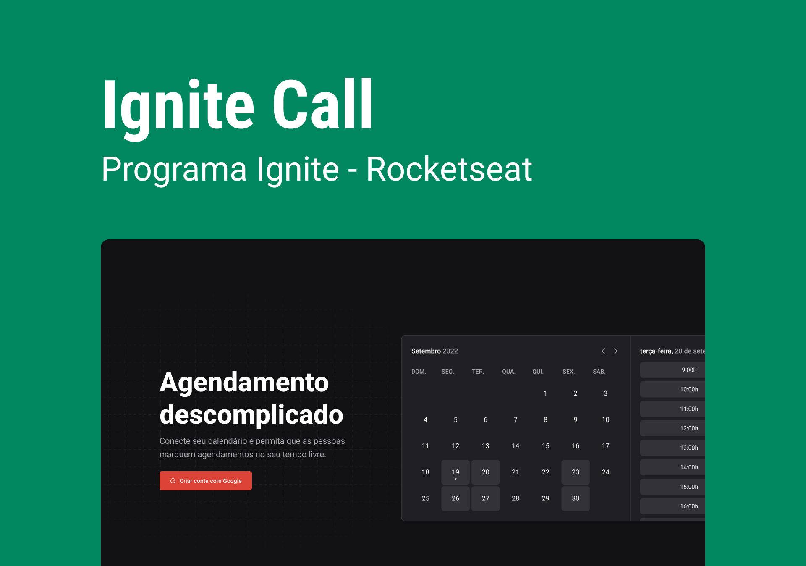

<h1 align="center"> Aplicação para marcar eventos no calendário </h1>

<p align="center">
#Agendamento descomplicado. <br/>
</p>

<p align="center">
  <a href="#-tecnologias">Tecnologias</a>&nbsp;&nbsp;&nbsp;|&nbsp;&nbsp;&nbsp;
  <a href="#-layout">Layout</a>&nbsp;&nbsp;&nbsp;|&nbsp;&nbsp;&nbsp;
  <a href="#memo-licença">Licença</a>
</p>

<p align="center">
  
</p>

<br>

<p align="center">
  
</p>
<br>

## 🎮 Para iniciar a aplicação
<br>

```bash
#instalar as dependencias da aplicação
npm i 

#iniciar a aplicação
npm run dev 

#Rodar o prisma studio para visualizar o banco de dados
npx prisma studio
```
## 🚀 Tecnologias

Esse projeto foi desenvolvido com as seguintes tecnologias:

- HTML e CSS e TypeScript
- Git e Github
- Figma
- Phosphor Icons
- React
- Next.JS
- Node.JS
- Prisma
- Next Auth
- Axios
- Zod
- nookies

## 🔖 Layout

Você pode visualizar o layout do projeto através [DESSE LINK](https://www.figma.com/community/file/1161274296921389678). É necessário ter conta no [Figma](https://figma.com) para acessá-lo.

## :memo: Licença

Esse projeto está sob a licença MIT.